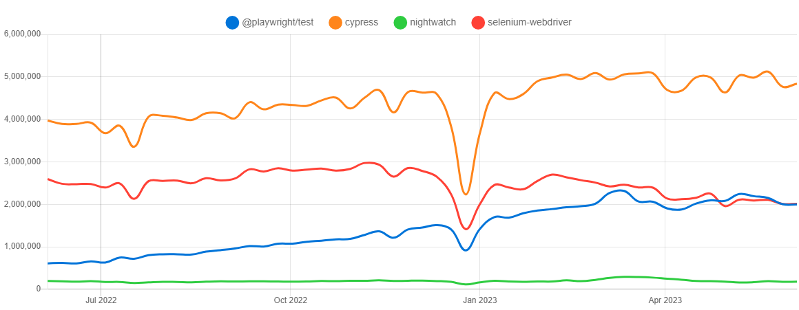
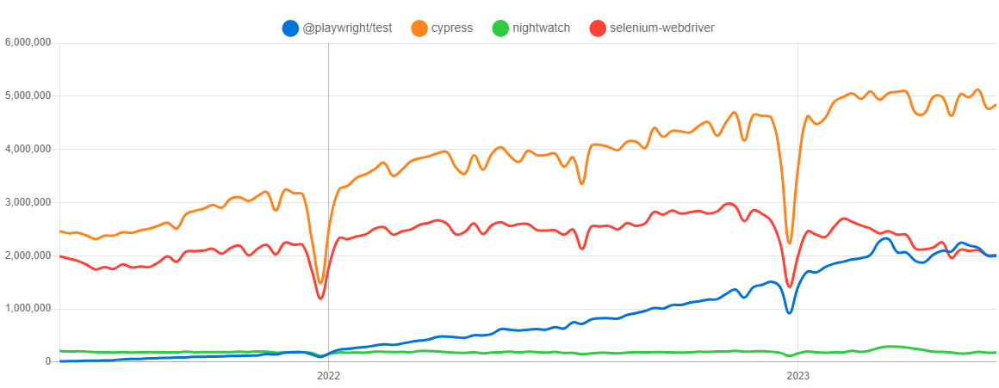
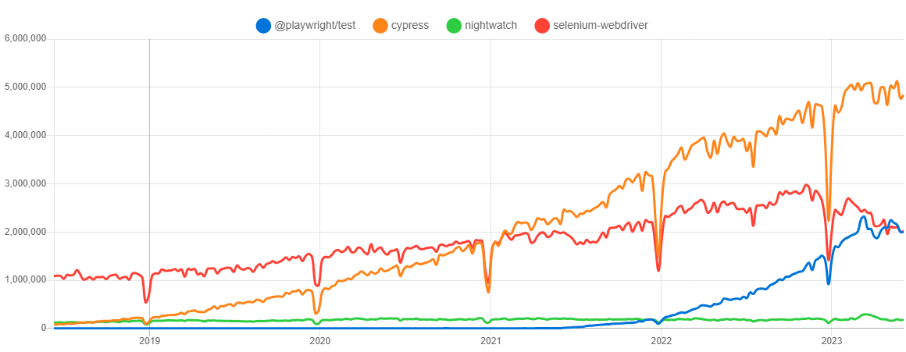
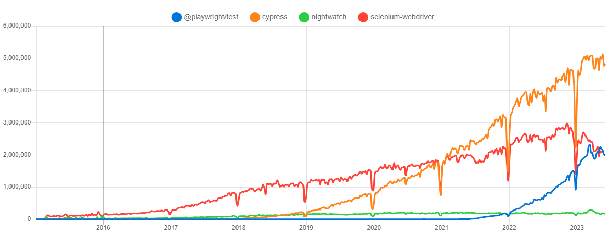

# Popularity of the 4 web-app. testing tools
 
  - [Trend on the NPM packages](#trend-on-the-npm-packages)
    - [Last year](#last-year)
    - [History, last 5 years](#history-last-5-years)
  - [Trend on GitHub](#trend-on-github)
  - [Trend on Google Search](#trend-on-google-search)

## Trend on the NPM packages

The Node.js versions of those tools are available as NPM packages.

| Tool                                                     | npm Package name / URL                                                   |
| -------------------------------------------------------- | ------------------------------------------------------------------------ |
| **Cypress.io**                                           | [`cypress`](https://www.npmjs.com/package/cypress)                       |
| **Nightwatch.js**                                        | [`nightwatch`](https://www.npmjs.com/package/nightwatch)                 |
| **Playwright Test** (Playwright Test runner, JS version) | [`@playwright/test`](https://www.npmjs.com/package/@playwright/test)     |
| **Selenium** (JS version)                                | [`selenium-webdriver`](https://www.npmjs.com/package/selenium-webdriver) |

On [npm](https://www.npmjs.com) Registry, and for each package, we can take the **number of weekly downloads** as an indicator of their popularity.

As for 04/06/2023, we have, for each package, on last 7 days:

| package name/url                                                         | number of weekly downloads |
| ------------------------------------------------------------------------ | -------------------------: |
| [`cypress`](https://www.npmjs.com/package/cypress)                       |                `4.839.698` |
| [`selenium-webdriver`](https://www.npmjs.com/package/selenium-webdriver) |                `2.013.031` |
| [`@playwright/test`](https://www.npmjs.com/package/@playwright/test)     |                `1.994.496` |
| [`nightwatch`](https://www.npmjs.com/package/nightwatch)                 |                  `179.653` |

Thats good, but we can have a better view of the popularity of each tool, by comparing them on the same graph. And see progression over time.

This was made with data from [`npm trends` (www.npmtrends.com)](https://www.npmtrends.com/@playwright/test-vs-cypress-vs-nightwatch-vs-selenium-webdriver).
On this site, we can see the popularity of each tool, by number of weekly downloads from NPM, with different time ranges. 

Before looking at graphs, let's see the evolution of each tool, compared to last year.

### Compared to last year, same period

| package name         | 5 june 2022 | 4 june 2023 | evolution |
| -------------------- | ----------: | ----------: | --------: |
| `@playwright/test`   |   `610.008` | `1.994.496` |     +227% |
| `cypress`            | `3.973.052` | `4.839.698` |      +22% |
| `selenium-webdriver` | `2.594.117` | `2.013.031` |      -22% |
| `nightwatch`         |   `195.832` |   `179.653` |       -8% |

 
We can see in the graphs below:
- **"`Cypress`" is still the most popular** framework, and keep growning.
- the **rapid rise of the "`Playwright`"** framework, since 2022.
- a slight decline in "`selenium-webdriver`" librairy weekly downloads, since beginning of 2023.

## NPM trend - over the past year

## NPM trend - over the past 2 years

## NPM trend - over the past 5 years

## NPM trend - since beginning

 
## Trend on GitHub

Comparison of number of stars on Github:

- [nightwatchjs/nightwatch](https://github.com/nightwatchjs/nightwatch)
- [cypress-io/cypress](https://github.com/cypress-io/cypress)
- [microsoft/playwright](https://github.com/microsoft/playwright)
- [SeleniumHQ/selenium](https://github.com/SeleniumHQ/selenium)

| Tool          | Number of stars on GitHub |
| ------------- | ------------------------: |
| Playwright    |                     51509 |
| Cypress.io    |                     43434 |
| Selenium      |                     26651 |
| Nightwatch.js |                     11370 |

> 24/05/2023

> source: https://www.github-trends.com/, 
> 
> with those repositories names list: `cypress-io/cypress`, `nightwatchjs/nightwatch`, `microsoft/playwright`, `SeleniumHQ/selenium`

Please note that:
- [SeleniumHQ/selenium](https://github.com/SeleniumHQ/selenium) is the repo for the Selenium "umbrella project", covering not only "test" automation. And this repository correspond not only JavaScript implementation. 

## Trend on Google Search

Interest[^2] over time, for each of this tools.

> source: https://trends.google.com/trends/explore?cat=32&date=2018-01-01%202023-05-17&q=playwright,cypress,selenium%20js,nightwatch,webdriverio&hl=en

> ⚠️ to be completed

----

_Notes :_

- [^1]:  30/04/13, cf. https://npmtrends.com/cypress-vs-nightwatch-vs-playwright-vs-selenium-webdriver
- [^2]: "_Interest over time_" number is defined by Google by: 
  > Numbers represent search interest relative to the highest point on the chart for the given region and time.
  > - a value of 100 is the peak popularity for the term. 
  > - a value of 50 means that the term is half as popular. 
  > - a score of 0 means there was not enough data for this term.