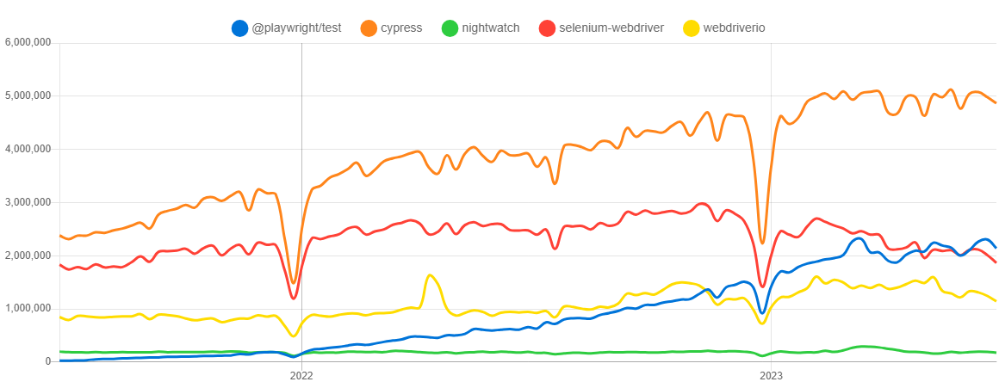
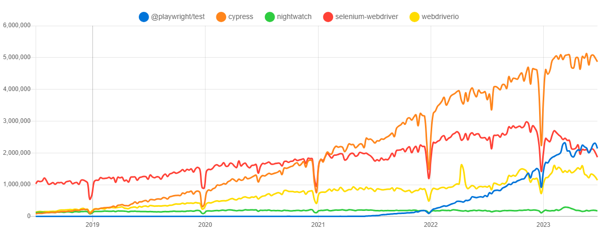
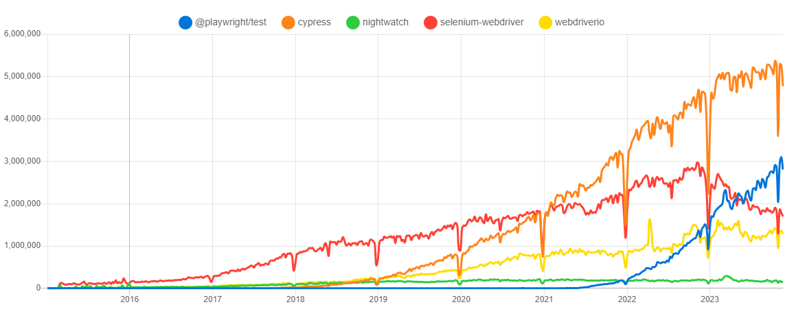
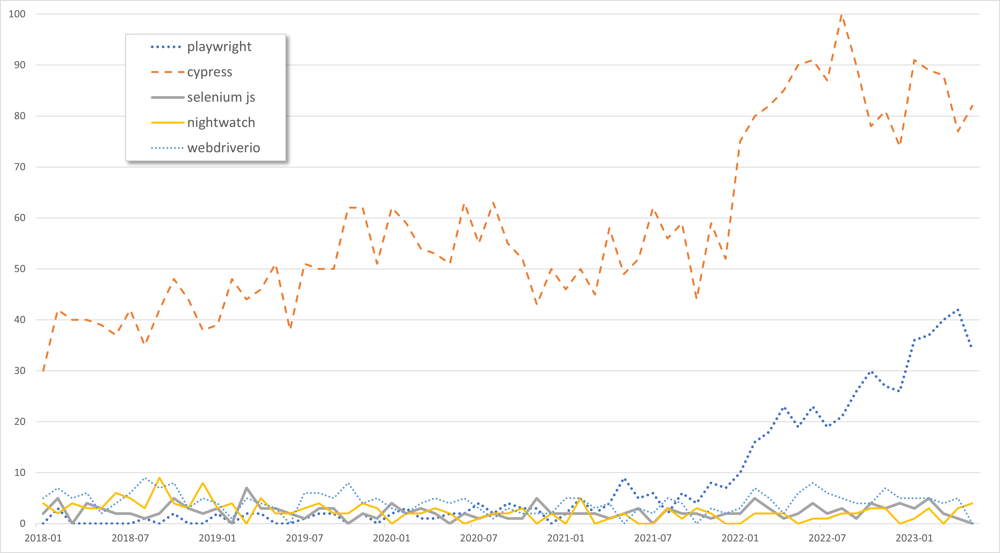

# Popularity of the 4 web-app. testing tools
 
  - [Trend on the NPM packages](#trend-on-the-npm-packages)
    - [Last year](#last-year)
    - [History, last 5 years](#history-last-5-years)
  - [Trend on GitHub](#trend-on-github)
  - [Trend on Google Search](#trend-on-google-search)

## Trend on the NPM packages

The Node.js versions of those tools are available as NPM packages. 

On [npm](https://www.npmjs.com) Registry, and for each package, we can take the **number of weekly downloads** as an indicator of their popularity.

| Tool                                                     | npm Package name / URL                                                   |
| -------------------------------------------------------- | ------------------------------------------------------------------------ |
| **Cypress.io**                                           | [`cypress`](https://www.npmjs.com/package/cypress)                       |
| **Nightwatch.js**                                        | [`nightwatch`](https://www.npmjs.com/package/nightwatch)                 |
| **Playwright Test** (Playwright Test runner, JS version) | [`@playwright/test`](https://www.npmjs.com/package/@playwright/test)     |
| **Selenium** (JS version)                                | [`selenium-webdriver`](https://www.npmjs.com/package/selenium-webdriver) |
| **WebdriverIO** (JS version)                             | [`webdriverio`](https://www.npmjs.com/package/webdriverio)               |

As for 02/07/2023, we have, for each package, on last 7 days:

| package name/url                                                         | number of weekly downloads |
| ------------------------------------------------------------------------ | -------------------------: |
| [`cypress`](https://www.npmjs.com/package/cypress)                       |                  `4865643` |
| [`@playwright/test`](https://www.npmjs.com/package/@playwright/test)     |                  `2140160` |
| [`selenium-webdriver`](https://www.npmjs.com/package/selenium-webdriver) |                  `1864334` |
| [`webdriverio`](https://www.npmjs.com/package/webdriverio)               |                  `1141885` |
| [`nightwatch`](https://www.npmjs.com/package/nightwatch)                 |                   `174739` |

Thats good, but we can have a better view of the popularity of each tool, by comparing them on the same graph. And see progression over time.

This was made with data from [`npm trends` (www.npmtrends.com)](https://www.npmtrends.com/@playwright/test-vs-cypress-vs-nightwatch-vs-selenium-webdriver).
On this site, we can see the popularity of each tool, by number of weekly downloads from NPM, with different time ranges. 

Before looking at graphs, let's see the evolution of each tool, compared to last year.

### Evolution compared to last year

| package name         | 3 july 2022 | 1 july 2023 | evolution |
| -------------------- | ----------: | ----------: | --------: |
| `@playwright/test`   |    `629646` |   `2140160` | **+240%** |
| `cypress`            |   `3673636` |   `4865643` |      +32% |
| `webdriverio`        |    `924956` |   `1141885` |      +23% |
| `nightwatch`         |    `171522` |    `179653` |       +2% |
| `selenium-webdriver` |   `2395860` |   `2013031` |      -22% |

 
We can see in the graphs below:
- **"`Cypress`" is still the most popular** framework, and keep growning.
- the **rapid rise of the "`Playwright`"** framework, since 2022.
- a slight decline in "`selenium-webdriver`" librairy weekly downloads, since beginning of 2023.

### NPM trend - graphs

Comparison between those 5  NPM packages: 
- [@playwright/test](https://www.npmjs.com/package/@playwright/test)
- [cypress](https://www.npmjs.com/package/cypress)
- [nightwatch](https://www.npmjs.com/package/nightwatch)
- [selenium-webdriver](https://www.npmjs.com/package/selenium-webdriver)
- [webdriverio](https://www.npmjs.com/package/webdriverio)

Graphs copied from [npm trends](https://www.npmtrends.com/@playwright/test-vs-cypress-vs-nightwatch-vs-selenium-webdriver-vs-webdriverio)

| period                | npm trend graph                                                                                                 |
| --------------------- | --------------------------------------------------------------------------------------------------------------- |
| over the past year    |      |
| over the past 2 years |    |
| over the past 5 years |    |
| since beginning       |  |

 
## Trend on GitHub

Each of those tools have a GitHub repository, and we can take the **number of stars** as an indicator of their popularity.

Each of those tools has more than 10k stars on GitHub. Some more quickly than others...

Comparison of number of stars on Github:

| Tool          | GitHub repository                                                     | Number of stars on GitHub (june 2023) | + 10k stars in... |
| ------------- | --------------------------------------------------------------------- | ------------------------------------: | ----------------- |
| Playwright    | [microsoft/playwright](https://github.com/microsoft/playwright)       |                                 52127 | 4 months          |
| Cypress.io    | [cypress-io/cypress](https://github.com/cypress-io/cypress)           |                                 43596 | 4 years           |
| Selenium [^3] | [SeleniumHQ/selenium](https://github.com/SeleniumHQ/selenium)         |                                 26804 | 6 years           |
| Nightwatch.js | [nightwatchjs/nightwatch](https://github.com/nightwatchjs/nightwatch) |                                 11383 | 8 years           |

  |  

## Trend on Google Search

Interest[^2] over time, for each of this tools.

> source: https://trends.google.com/trends/explore?cat=32&date=2018-01-01%202023-05-17&q=playwright,cypress,selenium%20js,nightwatch,webdriverio&hl=en

> ⚠️ to be completed

----

_Notes :_

- [^1]:  30/04/13, cf. https://npmtrends.com/cypress-vs-nightwatch-vs-playwright-vs-selenium-webdriver
- [^2]: "_Interest over time_" number is defined by Google by: 
  > Numbers represent search interest relative to the highest point on the chart for the given region and time.
  > - a value of 100 is the peak popularity for the term. 
  > - a value of 50 means that the term is half as popular. 
  > - a score of 0 means there was not enough data for this term.
- [^3]: [SeleniumHQ/selenium](https://github.com/SeleniumHQ/selenium) is the repo for the Selenium "umbrella project", covering not only "test" automation. And this repository correspond not only JavaScript implementation. 
