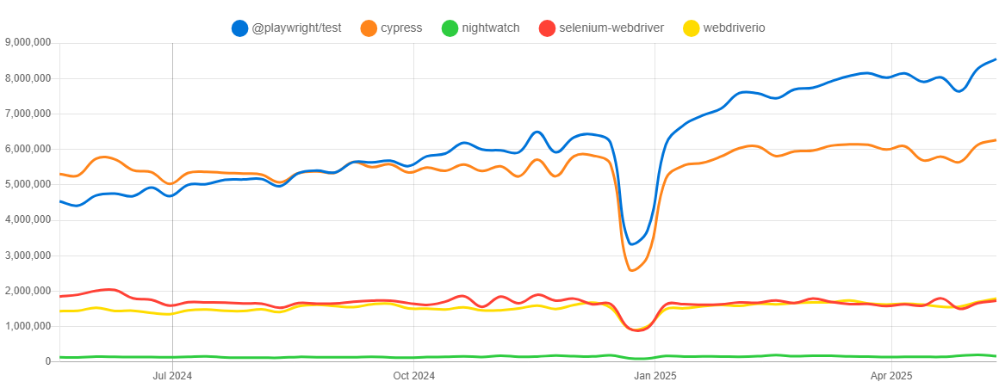
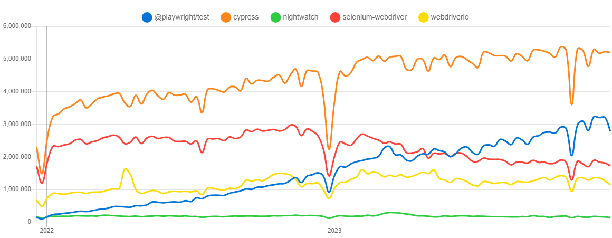
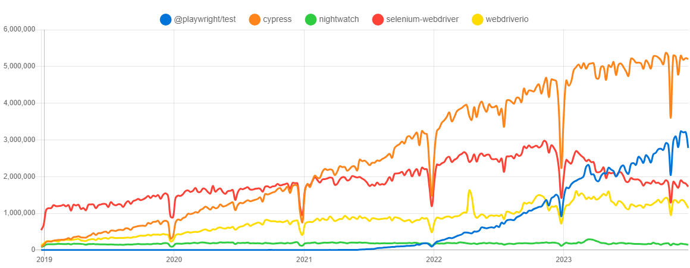
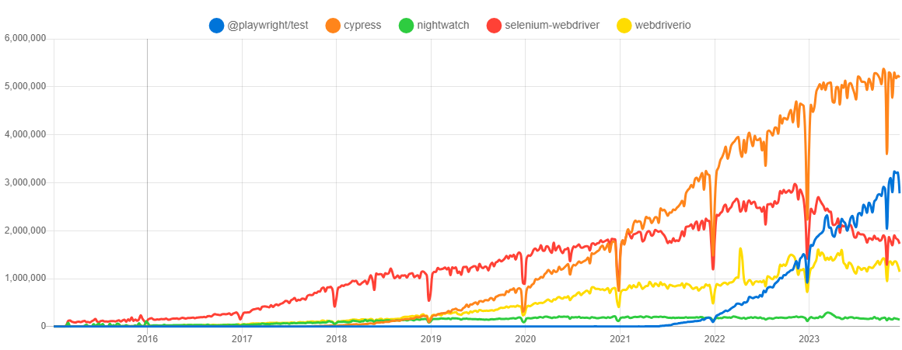

# Popularity of the 5 web-app. testing tools
 
  - [Trend on the NPM packages](#trend-on-the-npm-packages)
    - [Last year](#last-year)
    - [History, last 5 years](#history-last-5-years)
  - [Trend on GitHub](#trend-on-github)
  - [Trend on Google Search](#trend-on-google-search)

## Trend on the NPM packages

The Node.js versions of those tools are available as NPM packages. 

On [npm](https://www.npmjs.com) Registry, and for each package, we can take the **number of weekly downloads** as an indicator of their popularity.

 |                                                                | Tool                                                     | npm Package name / URL                                                   |
 | -------------------------------------------------------------- | -------------------------------------------------------- | ------------------------------------------------------------------------ |
 |   | **Cypress.io**                                           | [`cypress`](https://www.npmjs.com/package/cypress)                       |
 |  | **Nightwatch.js**                                        | [`nightwatch`](https://www.npmjs.com/package/nightwatch)                 |
 |  | **Playwright Test** (Playwright Test runner, JS version) | [`@playwright/test`](https://www.npmjs.com/package/@playwright/test)     |
 |    | **Selenium** (JS version)                                | [`selenium-webdriver`](https://www.npmjs.com/package/selenium-webdriver) |
 |   | **WebdriverIO** (JS version)                             | [`webdriverio`](https://www.npmjs.com/package/webdriverio)               |

As for 17/12/2023, we have, for each package, on last 7 days:

|                                                                | package name/url     | number of weekly downloads | ratio / least downloaded |
| -------------------------------------------------------------- | -------------------- | -------------------------: | -----------------------: |
|   | `cypress`            |                  `5197350` |                      36× |
|  | `nightwatch`         |                   `142971` |                        1 |
|  | `@playwright/test`   |                  `2779815` |                      19× |
|    | `selenium-webdriver` |                  `1726049` |                      12× |
|   | `webdriverio`        |                  `1142691` |                       8× |

Thats good, but we can have a better view of the popularity of each tool, by comparing them on the same graph. And see progression over time.

This was made with data from [`npm trends` (www.npmtrends.com)](https://www.npmtrends.com/@playwright/test-vs-cypress-vs-nightwatch-vs-selenium-webdriver-vs-webdriverio).
On this site, we can see the popularity of each tool, by number of weekly downloads from NPM, with different time ranges. 

Before looking at graphs, let's see the evolution of each tool, compared to last year.

### Evolution compared to last year 

Comparing downloads on last 7 days, between july 2022 and july 2023:

|                                                                | package name         | 3 july 2022 |     | 1 july 2023 | evolution |
| -------------------------------------------------------------- | -------------------- | ----------: | --- | ----------: | --------: |
|   | `cypress`            |   `3673636` | →   |   `4865643` |      +32% |
|  | `nightwatch`         |    `171522` | →   |    `179653` |       +2% |
|  | `@playwright/test`   |    `629646` | →   |   `2140160` | **+240%** |
|    | `selenium-webdriver` |   `2395860` | →   |   `2013031` |      -22% |
|   | `webdriverio`        |    `924956` | →   |   `1141885` |      +23% |

 
We can see in the graphs below:
- **"`Cypress`" is still the most popular** framework, and keep growning.
- the **rapid rise of the "`Playwright`"** framework, since 2022.
- a slight decline in "`selenium-webdriver`" librairy weekly downloads, since beginning of 2023.
- `WebdriverIO` seems to be less popular than the 3 others, but its usage keeps growing.
- Usage of "`Nightwatch`" seems to be stable, but its the less popular of the 5.

### NPM trend - graphs

Graphs copied from [npm trends](https://www.npmtrends.com/@playwright/test-vs-cypress-vs-nightwatch-vs-selenium-webdriver-vs-webdriverio) the 25/12/2023.

| period                | npm trend graph                                                                                                  |
| --------------------- | ---------------------------------------------------------------------------------------------------------------- |
| over the past year    |      |
| over the past 2 years |    |
| over the past 5 years |    |
| since beginning       |  |

## Trend on GitHub

Each of those "open-source" tools is hosted on a GitHub repository.

Like for all GitHub repositories, we can take several indicators as an indicator of their popularity: 
- how people are interested in the project,
- how many people contribute to the project,
- how many people use the project, etc.

List of repositories:

|                                                                | Tool          | GitHub repository name                                                                         |
| -------------------------------------------------------------- | ------------- | ---------------------------------------------------------------------------------------------- |
|   | Cypress.io    | https://github.com/**[`cypress-io/cypress`](https://github.com/cypress-io/cypress)**           |
|  | Nightwatch.js | https://github.com/**[`nightwatchjs/nightwatch`](https://github.com/nightwatchjs/nightwatch)** |
|  | Playwright    | https://github.com/**[`microsoft/playwright`](https://github.com/microsoft/playwright)**       |
|    | Selenium      | https://github.com/**[`SeleniumHQ/selenium`](https://github.com/SeleniumHQ/selenium)**         |
|   | WebdriverIO   | https://github.com/**[`webdriverio/webdriverio`](https://github.com/webdriverio/webdriverio)** |

There are several ways to compare the popularity of those tools on GitHub :

| indicator                               | meaning                                                                           |
| --------------------------------------- | --------------------------------------------------------------------------------- |
| number of **stars**                     | how many people "starred/bookmarked" the repository                               |
| number of forks                         | how many people "forked" the repository as a starting point for their own project |
| number of watchers                      | how many people "watch" the repository, to be notified of new commits             |
| number of **contributors**              | how many people contributed to the project                                        |
| number of commits and/or  pull requests | the activity made on the project                                                  |
| number of issues                        | how many issues were opened on the project                                        |
| number of dependents projects           | how many projects depends on this project                                         |

### 👨‍💻 Number of contributors

We can take the **number of contributors** as an indicator of their popularity.

Please note that contributors can be:
- either **human** or **robots** (like [Dependabot](https://github.com/dependabot), [GitHub Actions](https://github.com/features/actions) or other specific bots),
- for humans: **paid** by the company that maintains or sponsors the tool, or **volunteer** members of the opensource community
- that contribute to the code and/or to the documentation

Comparison of number of contributors on GitHub (december 2023):

|                                                                | Tool          | Number of contributors |
| -------------------------------------------------------------- | ------------- | ---------------------: |
|   | Cypress.io    |                    464 |
|  | Nightwatch.js |                    122 |
|  | Playwright    |                    488 |
|    | Selenium      |                    726 |
|   | WebdriverIO   |                    522 |

Note on top contributors, for each tool, in last 12 months (Jan 1, 2022 – Dec 25, 2023):

- Cypress.io : Naturaly, the [top contributors](https://github.com/cypress-io/cypress/graphs/contributors?from=2022-01-01&to=2023-12-25&type=c) are from Cypress.io (the company behind Cypress)
- For  Nightwatch.js : [main contributors](https://github.com/nightwatchjs/nightwatch/graphs/contributors?from=2022-01-01&to=2023-12-25&type=c) works at [BrowserStack](https://www.browserstack.com/), the company that supports Nightwatch.
- WebdriverIO : [Christian Bromann](https://github.com/christian-bromann/christian-bromann), previously at Sauce Labs, now at Ionic is the [main contributor](https://github.com/webdriverio/webdriverio/graphs/contributors?from=2022-01-01&to=2023-12-25&type=c).
- Playwright : The [5 top contributors](https://github.com/microsoft/playwright/graphs/contributors?from=2022-01-01&to=2023-12-25&type=c) are from **Microsoft**, and between them 4 worked at Google (on Chrome/DevTools) until 2019 and then at full-time on the Playwright project since its beginning (2019).
- For Selenium, its more difficult to say who are the [top contributors](https://github.com/SeleniumHQ/selenium/graphs/contributors?from=2022-01-01&to=2023-12-25&type=c) for the Node.js version, as Selenium project is a "umbrella project" that cover several languages and tools.

### ⭐ Number of Stars on GitHub

We can take the **number of stars** as an indicator of their popularity.

Allmost all those tools has more than 10k stars on GitHub. Some more quickly than others...

Comparison of number of stars on GitHub (december 2023):

| Tool          | Number of stars on GitHub | + 5k stars in... | + 10k stars in... |
| ------------- | ------------------------: | ---------------- | ----------------- |
| Cypress.io    |                     45401 | 3 years          | 4 years           |
| Nightwatch.js |                     11507 | 3 years          | 8 years           |
| Playwright    |                     57606 | 1 month          | 4 months          |
| Selenium      |                     28459 | 4 years          | 6 years           |
| WebdriverIO   |                      8433 | 8 years          | not yet...        |

#### "Aligned timeline" view

The "aligned timeline" view indicates how many "stars" each tool has, after N years of existence.
>
> 

#### "by date" view

The "by date" view gives how many "stars" each tool has, at a given date.

>  

## Trend on Google Search

Interest[^2] over time, for each of this tools.

> source: https://trends.google.com/trends/explore?cat=32&date=2018-01-01%202023-05-17&q=playwright,cypress,selenium%20js,nightwatch,webdriverio&hl=en

> ⚠️ to be completed

----

_Notes :_
 
- [^2]: "_Interest over time_" number is defined by Google by: 
  > Numbers represent search interest relative to the highest point on the chart for the given region and time.
  > - a value of 100 is the peak popularity for the term. 
  > - a value of 50 means that the term is half as popular. 
  > - a score of 0 means there was not enough data for this term.

- [n-1]: [SeleniumHQ/selenium](https://github.com/SeleniumHQ/selenium) is the repo for the Selenium "umbrella project", covering not only "test" automation. And this repository correspond not only JavaScript implementation. 
