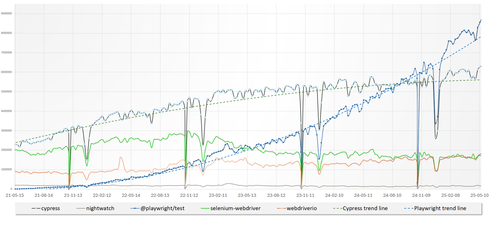
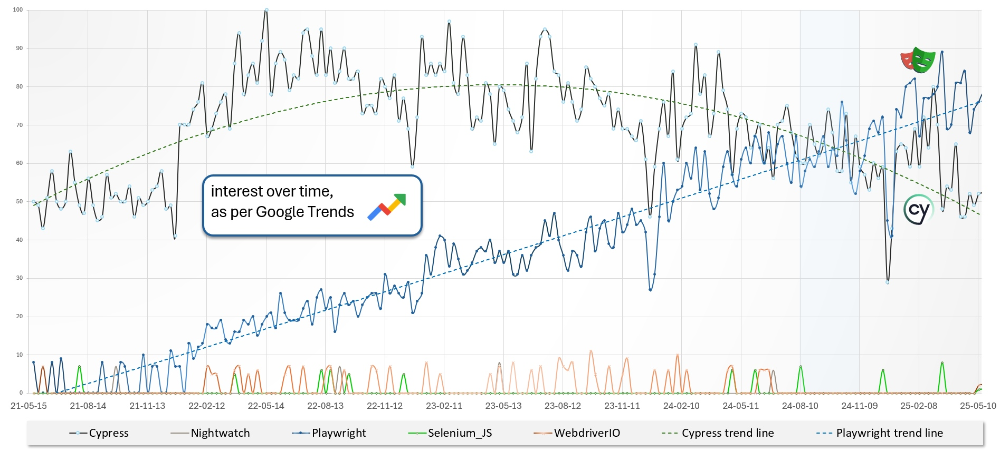

# Benchmark of 5 web-applications testing tools: comparing popularity

|           | Benchmark of 5 web-applications testing tools: comparing popularity |
| --------- | ------------------------------------------------------------------- |
| _Author_  | Alhusaine NEMER – [test'n'dev](https://testndev.com/)               |
| _Date_    | 25/05/2025                                                          |
| _Version_ | 1.02                                                                |
| _Licence_ | <a href="#licence">CC BY-NC-ND 4.0</a>                              |

---

- [Popularity of the 5 web-app. testing tools](#popularity-of-the-5-web-app-testing-tools)
  - [Introduction](#introduction)
  - [Methodology](#methodology)
  - [Summary](#summary)
  - [Trend on the NPM packages](#trend-on-the-npm-packages)
    - [Evolution compared to last year](#evolution-compared-to-last-year)
    - [NPM trend - graphs](#npm-trend---graphs)
  - [Trend on GitHub](#trend-on-github)
    - [👨‍💻 Number of contributors](#-number-of-contributors)
    - [⭐ Number of Stars on GitHub](#-number-of-stars-on-github)
      - ["Aligned timeline" view](#aligned-timeline-view)
      - ["by date" view](#by-date-view)
  - [Trend on Google Search](#trend-on-google-search)

## Introduction

In this section of "Benchmark of web-applications testing tools" article, we will compare **popularity** of the 5 tools chosen [above](https://articles.testndev.com/testing/300-web-app-testing-tools-benchmark.html):

1. [Cypress.io](https://cypress.io/)
2. [Nightwatch.js](https://nightwatchjs.org)
3. [Playwright](https://playwright.dev/)
4. [Selenium WebDriver](https://www.selenium.dev/documentation/webdriver/)
5. [WebdriverIO](https://webdriver.io/)

## Methodology

We will use several indicators to compare the popularity of those tools:

- number of weekly downloads on NPM
- number of stars on GitHub
- interest over time on Google Search

## Summary

The table below gives you an overview of the relative popularity of these 5 tools, with a few indicators and their evolution:

## Trend on the NPM packages

The Node.js versions of those tools are available as NPM packages.

On [npm](https://www.npmjs.com) Registry, and for each package, we can take the **number of weekly downloads** as an indicator of their popularity.

As for 25/05/2025, we have, for each package, on last 7 days:

| Tool            | Package name                                                             | 19 May 2024 | 24 May 2025     | evolution |
| --------------- | ------------------------------------------------------------------------ | ----------- | --------------- | --------- |
| Cypress.io      | [`cypress`](https://www.npmjs.com/package/cypress)                       | `5 305 893` | **`6 352 192`** | +20,7%    |
| Nightwatch.js   | [`nightwatch`](https://www.npmjs.com/package/nightwatch)                 | ` 134 390`  | **`  183 956`** | +40,6%    |
| Playwright Test | [`@playwright/test`](https://www.npmjs.com/package/@playwright/test)     | `4 532 739` | **`8 834 168`** | +100,2%   |
| Selenium        | [`selenium-webdriver`](https://www.npmjs.com/package/selenium-webdriver) | `1 848 423` | **`1 672 647`** | -11,9%    |
| WebdriverIO     | [`webdriverio`](https://www.npmjs.com/package/webdriverio)               | `1 437 007` | **`1 827 595`** | +26,2%    |

- The most downloaded packages seems to be `@playwright/test` framework, with more than 8.8 millions weekly downloads.
- It's followed by `cypress` framework with more than 6.3 millions weekly downloads.
- The `webdriverio` testing framework is the third most downloaded package, with near 1.8 millions weekly downloads.
- The `selenium-webdriver` library is the fourth most downloaded package, with near 1.7 millions weekly downloads.
- While `nightwatch` framework is the less downloaded package, with ~ 183 thousands of weekly downloads.

Thats good, but we can have a better view of the popularity of each tool, by comparing them on the same graph. And see progression over time.

> This was made with data from [`npm trends` (www.npmtrends.com)](https://www.npmtrends.com/@playwright/test-vs-cypress-vs-nightwatch-vs-selenium-webdriver-vs-webdriverio).

We can see in the graphs below:

- **"`Playwright`" is the most popular** framework, since September 2024,and keep growing.
- **"`Cypress`"** framework is the second most popular, and keep growing too.
- a slight decline in "`selenium-webdriver`" library weekly downloads, since beginning of 2023.
- `WebdriverIO` seems to be less popular than the 3 others, but its usage keeps growing, and is now near the `selenium-webdriver` library.
- Usage of "`Nightwatch`" seems to be stable, but its the less popular of the 5.

## Trend on GitHub

Each of those "open-source" tools is hosted on a GitHub repository.

Like for all GitHub repositories, we can take several indicators as an indicator of their popularity:

- how people are interested in the project,
- how many people contribute to the project,
- how many people use the project, etc.

List of repositories:

| Tool          | GitHub repository name                                                                         |
| ------------- | ---------------------------------------------------------------------------------------------- |
| Cypress.io    | https://github.com/**[`cypress-io/cypress`](https://github.com/cypress-io/cypress)**           |
| Nightwatch.js | https://github.com/**[`nightwatchjs/nightwatch`](https://github.com/nightwatchjs/nightwatch)** |
| Playwright    | https://github.com/**[`microsoft/playwright`](https://github.com/microsoft/playwright)**       |
| Selenium      | https://github.com/**[`SeleniumHQ/selenium`](https://github.com/SeleniumHQ/selenium)**         |
| WebdriverIO   | https://github.com/**[`webdriverio/webdriverio`](https://github.com/webdriverio/webdriverio)** |

There are several ways to compare the popularity of those tools on GitHub :

| indicator                              | meaning                                                                           |
| -------------------------------------- | --------------------------------------------------------------------------------- |
| number of **stars**                    | how many people "starred/bookmarked" the repository                               |
| number of forks                        | how many people "forked" the repository as a starting point for their own project |
| number of watchers                     | how many people "watch" the repository, to be notified of new commits             |
| number of **contributors**             | how many people contributed to the project                                        |
| number of commits and/or pull requests | the activity made on the project                                                  |
| number of issues                       | how many issues were opened on the project                                        |
| number of dependents projects          | how many projects depends on this project                                         |

### 👨‍💻 Number of contributors

We can take the **number of contributors** as an indicator of their popularity.

Please note that contributors can be:

- either **human** or **robots** (like [Dependabot](https://github.com/dependabot), [GitHub Actions](https://github.com/features/actions) or other specific bots),
- for humans: **paid** by the company that maintains or sponsors the tool, or **volunteer** members of the opensource community
- that contribute to the code and/or to the documentation

Comparison of number of contributors on GitHub (as per 21 May 2025):

|                        |       **Cypress.io**           |           **Nightwatch.js**              |       **Playwright Test**          |         **Selenium**             |            **WebdriverIO**               |
| ---------------------- | :-----------------------------------------------------------: | :---------------------------------------------------------------------: | :---------------------------------------------------------------: | :-------------------------------------------------------------: | :---------------------------------------------------------------------: |
| GitHub repository      | [`cypress-io/cypress`](https://github.com/cypress-io/cypress) | [`nightwatchjs/nightwatch`](https://github.com/nightwatchjs/nightwatch) | [`microsoft/playwright`](https://github.com/microsoft/playwright) | [`SeleniumHQ/selenium`](https://github.com/SeleniumHQ/selenium) | [`webdriverio/webdriverio`](https://github.com/webdriverio/webdriverio) |
| Number of contributors |                              506                              |                                   140                                   |                                631                                |                               780                               |                                   642                                   |

Note on top contributors, for each tool, in last 12 months (18 May 2024 to 18 May 2025):

- Cypress.io : Naturally, 4 of 5 [top contributors](https://github.com/cypress-io/cypress/graphs/contributors?type=c&from=18%2F05%2F2024&to=18%2F05%2F2025) are from Cypress.io (the company behind Cypress)
- For Nightwatch.js : Some [contributors](https://github.com/nightwatchjs/nightwatch/graphs/contributors?from=18%2F05%2F2024&type=c) (among them [David Burns aka AutomatedTester](https://github.com/AutomatedTester)) work at [BrowserStack](https://www.browserstack.com/), the company that supports Nightwatch.
- WebdriverIO : [Christian Bromann](https://github.com/christian-bromann/christian-bromann), previously at Sauce Labs, now at Ionic is the [main contributor](https://github.com/webdriverio/webdriverio/graphs/contributors?from=18%2F05%2F2024&type=c&to=18%2F05%2F2025).
- Playwright : The [5 top contributors](https://github.com/microsoft/playwright/graphs/contributors?type=c&from=18%2F05%2F2024&to=18%2F05%2F2025) are from **Microsoft**, and between them 4 worked at Google (on Chrome/DevTools) until 2019 and then at full-time on the Playwright project since its beginning (2019).
- For Selenium, its more difficult to say who are the [top contributors](https://github.com/SeleniumHQ/selenium/graphs/contributors?from=2022-01-01&to=2023-12-25&type=c) for the Node.js version, as Selenium project is a "umbrella project" that cover several languages and tools.

### ⭐ Number of Stars on GitHub

We can take the **number of stars** as an indicator of their popularity.

The number of stars is a good indicator of how many people are interested in the project, but it doesn't mean that they are using it.

Almost all those tools has more than 10k stars on GitHub. Some more quickly than others...

Comparison of number of stars on GitHub (21 may 2025):

| Tool          | Number of stars on GitHub | + 5k stars in... | + 10k stars in... | +20k in ... |
| ------------- | ------------------------: | ---------------- | ----------------- | ----------- |
| Playwright    |                    72.767 | 1 month          | 4 months          | 15 months   |
| Cypress.io    |                    48.614 | 3 years          | 4 years           | 5 years     |
| Selenium      |                    32.346 | 4 years          | 6 years           | 9 years     |
| Nightwatch.js |                    11.924 | 3 years          | 8 years           | not yet...  |
| WebdriverIO   |                     9.493 | 8 years          | 14 years          | not yet...  |

#### "Aligned timeline" view

The "aligned timeline" view indicates how many "stars" each tool has, after N years of existence.

> 

#### "by date" view

The "by date" view gives how many "stars" each tool has, at a given date.

> 

## Trend on Google Search

Google offers "Google Trends" as a data exploration tool that shows what terms people are searching for on Google (search engine) in real time.

It can be used to measure the search interest in a particular topic, location, or language at a particular time.

We can use it to compare the popularity of each tool.

For this, Google Trends offers a "interest over time" metric, that shows the popularity of a search term over time. "_Interest over time_" number is defined by Google by:

> Numbers represent search interest relative to the highest point on the chart for the given region and time.
>
> - a value of 100 is the peak popularity for the term.
> - a value of 50 means that the term is half as popular.
> - a score of 0 means there was not enough data for this term.

We gave to "Google Trends" the following search terms to Google Trends: `Cypress`, `Nightwatch`, `Playwright`, `Selenium JS` and `WebdriverIO`.

> note: the "`Selenium JS`" search term is used to filter results on Selenium JavaScript version, and not on other languages.

And we filtered results with the parameters:

- location: **worldwide**
- time: from 10/05/2021 to 20/05/2025
- category: "Computers & Electronics > Software"
- web search

The below graph represent "interest over time", for each of those tools, from October 2022 to May 2025.

We can see in the graphs above:

- Of these 5 frameworks, **"`Playwright`"** is the **most searched for** on Google in 2025.
  - We can observe that its interest is growing over time:
    "_Interest over time_" was in [10 ; 30] range in 2022, [20 ; 50] in 2023, [50 ; 70] in 2024 and [70 ; 90] in 2025.
- Since September 2024, **`Cypress`** comes now in second place, after it was the most searched from 2022 to 2024.
- The 3 other (`Nightwatch`, `Selenium JS` and `WebdriverIO`) seem to be much less "searched" on Google ("_Interest over time_" maximal value is 20).

> source: https://trends.google.com/trends/explore?cat=32&date=2021-05-10%202025-05-20&q=Cypress,Nightwatch,Playwright,Selenium%20JS,WebdriverIO&hl=en
>
> captured on 20/05/2025

---

_Notes :_

- [n-1]: [SeleniumHQ/selenium](https://github.com/SeleniumHQ/selenium) is the repo for the Selenium "umbrella project", covering not only "test" automation. And this repository correspond not only JavaScript implementation.
