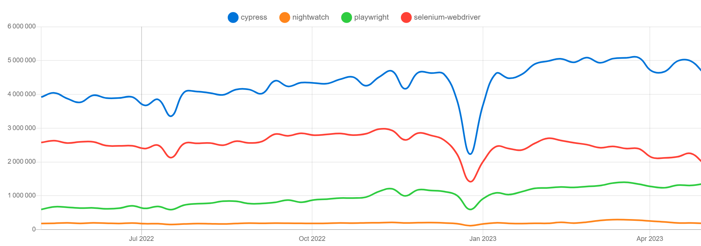
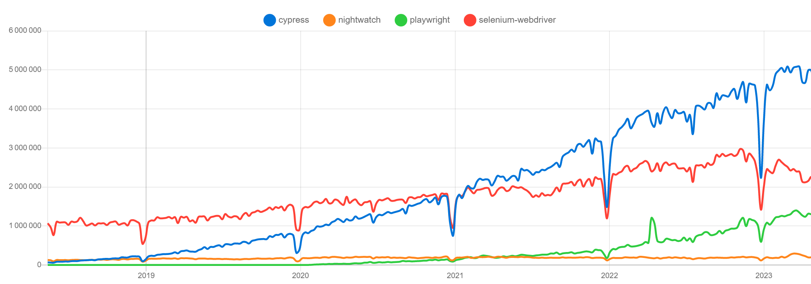
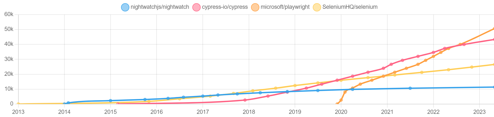

# Benchmark of web-applications testing tools

|           | Benchmark of web-applications testing tools           |
| --------- | ----------------------------------------------------- |
| _Author_  | Alhusaine NEMER – [test'n'dev](https://testndev.com/) |
| _Date_    | 17/05/2023                                            |
| _Version_ | 0.4                                                   |
| _Licence_ | <a href="#licence">CC BY-NC-ND 4.0</a>                |

---

- [Benchmark of web-applications testing tools](#benchmark-of-web-applications-testing-tools)
  - [Introduction](#introduction)
  - [Quick comparison of the 4 compared tools](#quick-comparison-of-the-4-compared-tools)
  - [Popularity](#popularity)
    - [Trend on the NPM packages](#trend-on-the-npm-packages)
      - [last week](#last-week)
      - [Last year](#last-year)
      - [History, last 5 years](#history-last-5-years)
    - [Trend on Github ... 🚧](#trend-on-github--)
    - [Trend on Google search ... 🚧](#trend-on-google-search--)
  - [Technical comparison](#technical-comparison)
  - [Installation 🚧](#installation-)
  - [Performance 🚧](#performance-)
  - [Conclusion](#conclusion)

---

> ⚠️ to be completed

## Introduction

In this article, we will compare some of popular tools used for web testing automation. We will focus on **open-source** tools, tools available in [Node.js](https://nodejs.org) / TypeScript implementations.

We will begin with 4 tools: 
- [Cypress.io](https://cypress.io/)
- *vs* [Nightwatch.js](https://nightwatchjs.org) 
- *vs* [Playwright](https://playwright.dev/) 
- *vs* [Selenium WebDriver](https://www.selenium.dev/documentation/webdriver/)

> Indeed, in this article, and to be fair in the comparison, we will take JavaScript/TypeScript versions of Playwright and Selenium.

We will use our code hosted on [`testndev/web-app-testing-tools-benchmark`](https://github.com/testndev/web-app-testing-tools-benchmark/) repository for our technical benchmark.

## Quick comparison of the 4 compared tools

## Popularity

| aspect                    | Cypress  | Selenium | Playwright | Nighwatch |
| ------------------------- | -------- | -------- | ---------- | --------- |
| NPM weekly downloads [^1] | > 4.600k | > 1.900k | > 1.300k   | > 180k    |
| Github stars              | > 43k    | > 26k    | > 50k      | > 11k     |
| Followers on Twitter      | > 21k    | >23k     | > 9k       | > 3k      |

### Trend on the NPM packages

From [npm trends](https://npmtrends.com/cypress-vs-nightwatch-vs-playwright-vs-selenium-webdriver), we can see the popularity of each tool, by number of weekly downloads from NPM. 

#### last week
As for 13/05/2023, we have:

| 🔵 Cypress | 🔴 Selenium | 🟢 Playwright | 🟠 Nightwatch |
| --------- | ---------- | ------------ | ------------ |
| > 4.600k  | > 1.900k   | > 1.300k     | > 180k       |

#### Last year

> NPM weekly downloads of each package (cypress / nightwatch / playwright / selenium-webdriver), over the past year [^1] 

#### History, last 5 years

We can see in the graph below the rapid rise of the "Playwright" framework from 2020.

> same over the past 5 years 

### Trend on Github ... 🚧

Comparison of number of stars on Github:

- [nightwatchjs/nightwatch](https://github.com/nightwatchjs/nightwatch)
- [cypress-io/cypress](https://github.com/cypress-io/cypress)
- [microsoft/playwright](https://github.com/microsoft/playwright)
- [SeleniumHQ/selenium](https://github.com/SeleniumHQ/selenium)

> source: https://www.github-trends.com/

Please note that:
- [SeleniumHQ/selenium](https://github.com/SeleniumHQ/selenium) is the repo for the Selenium "umbrella project", covering not only "test" automation. And this repository correspond not only JavaScript implementation. 

### Trend on Google search ... 🚧

Interest over time, for each of this tools.

> source: https://trends.google.com/trends/explore?cat=32&date=2018-01-01%202023-05-17&q=playwright,cypress,selenium%20js,nightwatch,webdriverio&hl=en

> ⚠️ to be completed

## Technical comparison

| aspect                                   | Cypress        | Nighwatch    | Playwright              | Selenium  |
| ---------------------------------------- | -------------- | ------------ | ----------------------- | --------- |
| Other than JS/TS?                        | No             | No           | Yes (C#, Java, Python)  | Yes, many |
| Protocol                                 | Inside Browser | WebDriver    | > CDP (debug protocols) | WebDriver |
| Open-source & supported/developped by... | Cypress        | BrowserStack | Microsoft               | Community |
 
> ⚠️ to be completed

## Installation 🚧

> ⚠️ to be completed

## Performance 🚧

> ⚠️ to be completed

## See also

There is many articles that compare web-app test automation frameworks (especially Selenium vs Cypress vs Playwright since 2022), presenting their features, trade-offs, etc. 

You can read for example:
- ["Which web testing tool should i use?"](https://automationpanda.com/2023/04/24/which-web-testing-tool-should-i-use)   
  > (in english, 24/04/2023, by [*Andrew Knight*](https://twitter.com/automationpanda))
- ["Choix du logiciel et avis - Framework : Selenium vs Playwright vs Cypress"](https://blog.mrsuricate.com/choix-logiciel-avis-framework-selenium-playwright-cypress)
  > (in french, 13/03/2023, by [*Mr Suricate*](https://www.mrsuricate.com/))
- [Playwright vs. the world](https://medium.com/@jfgreffier/playwright-vs-the-world-c783e9bf4fc4)
  > (in french, 31/01/2023, by [*Jean-François Greffier*](https://linktr.ee/jfgreffier))
- [Cypress vs Selenium vs Playwright vs Puppeteer speed comparison](https://rag0g.medium.com/cypress-vs-selenium-vs-playwright-vs-puppeteer-speed-comparison-73fd057c2ae9)
  > (in english, 04/03/2021 by [*Giovanni Rago*](https://rag0g.medium.com/))

## Conclusion

> ⚠️ to be completed

----

---

_Licence_

 
 

This article is licensed under the terms of the 
<a rel="license" href="http://creativecommons.org/licenses/by-nc-nd/4.0/">__Attribution-NonCommercial-NoDerivatives 4.0 International (CC BY-NC-ND 4.0)__</a> License

---

_Credits :_

...

---

_Photo Credits :_

- ...
  

_Illustrations Credits :_
- [^1]:  30/04/13, cf. https://npmtrends.com/cypress-vs-nightwatch-vs-playwright-vs-selenium-webdriver
    