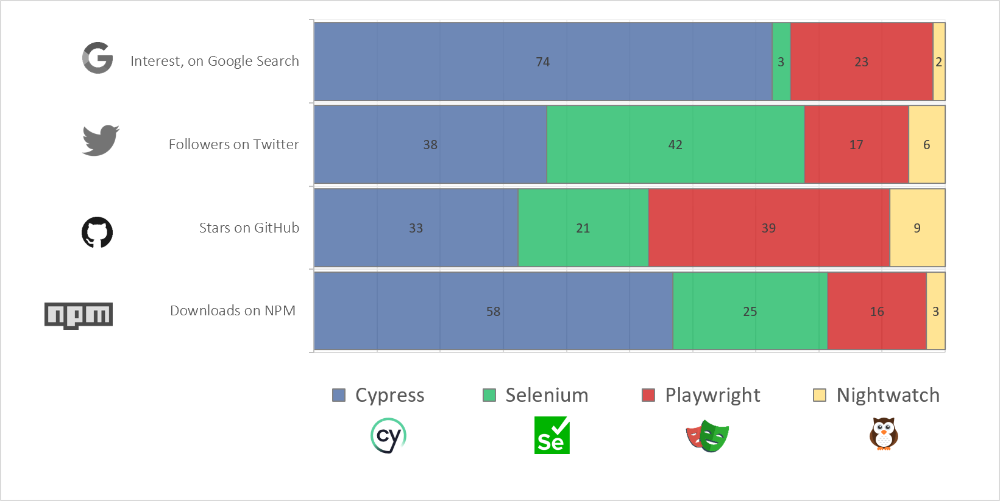

# Benchmark of web-applications testing tools

|           | Benchmark of web-applications testing tools           |
| --------- | ----------------------------------------------------- |
| _Author_  | Alhusaine NEMER – [test'n'dev](https://testndev.com/) |
| _Date_    | 17/05/2023                                            |
| _Version_ | 0.4                                                   |
| _Licence_ | <a href="#licence">CC BY-NC-ND 4.0</a>                |

---

- [Benchmark of web-applications testing tools](#benchmark-of-web-applications-testing-tools)
  - [Introduction](#introduction)
  - [Quick comparison of the 4 compared tools](#quick-comparison-of-the-4-compared-tools)
  - [Popularity](#popularity)
    - [Trend on the NPM packages](#trend-on-the-npm-packages)
      - [last week](#last-week)
      - [Last year](#last-year)
      - [History, last 5 years](#history-last-5-years)
    - [Trend on GitHub](#trend-on-github)
    - [Trend on Google Search](#trend-on-google-search)
  - [Technical comparison](#technical-comparison)
  - [Installation 🚧](#installation-)
  - [Performance 🚧](#performance-)
  - [See also](#see-also)
  - [Conclusion](#conclusion)

---

> ⚠️ to be completed

## Popularity
 

 | indicator                           | Cypress | Selenium | Playwright | Nightwatch |
 | ----------------------------------- | ------- | -------- | ---------- | ---------- |
 | NPM weekly downloads [^1]           | 4908680 | 2088040  | 1304640    | 180000     |
 | Github stars                        | 43434   | 26651    | 51509      | 11370      |
 | Followers on Twitter                | 21000   | 23000    | 9000       | 3000       |
 | Interest over time on Google Trends | 84,71   | 2,65     | 26,29      | 1,71       |

> as per end of may 2023, this graph shows the relative popularity of each tool, according to the previous indicators (NPM downloads, Github stars, Twitter followers, Google Trends). 

See more details in ["popularity" sub-page](./300-web-app-testing-tools-benchmark-popularity.md).
## Introduction

In this article, we will compare some of popular tools used for web testing automation. 

We will focus on tools having those characteristics:
- **open-source** tools
- executable on [Node.js](https://nodejs.org) platform
- with implementation possible in TypeScript 
- **mature** and quiet popular

We will begin with 4 tools (in alphabetical order): 

1. [Cypress.io](https://cypress.io/)                                       
2. [Nightwatch.js](https://nightwatchjs.org)                              
3. [Playwright](https://playwright.dev/)                                  
4. [Selenium WebDriver](https://www.selenium.dev/documentation/webdriver/)

> Indeed, in this article, and to be fair in the comparison, we will take JavaScript/TypeScript versions of Playwright and Selenium.

We will use our code hosted on [`testndev/web-app-testing-tools-benchmark`](https://github.com/testndev/web-app-testing-tools-benchmark/) repository for our technical benchmark.

## Quick presentation of the compared tools

> ⚠️ to be completed

## Quick comparison of the 4 compared tools

## Technical comparison

| aspect                                   | Cypress        | Nighwatch    | Playwright              | Selenium  |
| ---------------------------------------- | -------------- | ------------ | ----------------------- | --------- |
| Other than JS/TS?                        | No             | No           | Yes (C#, Java, Python)  | Yes, many |
| Protocol                                 | Inside Browser | WebDriver    | > CDP (debug protocols) | WebDriver |
| Open-source & supported/developped by... | Cypress        | BrowserStack | Microsoft               | Community |
 
> ⚠️ to be completed

## Installation 🚧

> ⚠️ to be completed

## Performance 🚧

> ⚠️ to be completed

## See also

There is many articles that compare web-app test automation frameworks (especially Selenium vs Cypress vs Playwright since 2022), presenting their features, trade-offs, etc. 

You can read for example:
- ["Which web testing tool should i use?"](https://automationpanda.com/2023/04/24/which-web-testing-tool-should-i-use)   
  > (in english, 24/04/2023, by [*Andrew Knight*](https://twitter.com/automationpanda))
- ["Choix du logiciel et avis - Framework : Selenium vs Playwright vs Cypress"](https://blog.mrsuricate.com/choix-logiciel-avis-framework-selenium-playwright-cypress)
  > (in french, 13/03/2023, by [*Mr Suricate*](https://www.mrsuricate.com/))
- [Playwright vs. the world](https://medium.com/@jfgreffier/playwright-vs-the-world-c783e9bf4fc4)
  > (in french, 31/01/2023, by [*Jean-François Greffier*](https://linktr.ee/jfgreffier))
- [Cypress vs Selenium vs Playwright vs Puppeteer speed comparison](https://rag0g.medium.com/cypress-vs-selenium-vs-playwright-vs-puppeteer-speed-comparison-73fd057c2ae9)
  > (in english, 04/03/2021 by [*Giovanni Rago*](https://rag0g.medium.com/))

## Conclusion

> ⚠️ to be completed

----

---

_Licence_

 
 

This article is licensed under the terms of the 
<a rel="license" href="http://creativecommons.org/licenses/by-nc-nd/4.0/">__Attribution-NonCommercial-NoDerivatives 4.0 International (CC BY-NC-ND 4.0)__</a> License

---

_Credits :_

...

---

_Photo Credits :_

- ...
  

