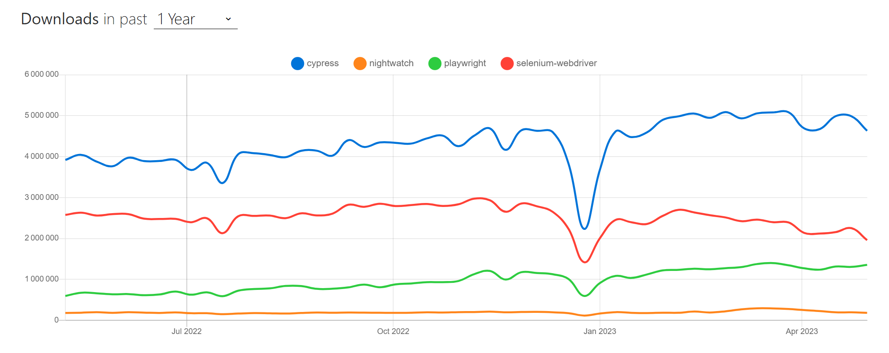

# Benchmark of web-applications testing tools

|           | le « test » logiciel : 4 définitions                                                                       |
| --------- | ---------------------------------------------------------------------------------------------------------- |
| _Auteur_  | Alhusaine NEMER – [test'n'dev](https://testndev.com/)                                                      |
| _Date_    | 13/05/2023                                                                                                 |
| _Version_ | 0.1                                                                                                        |
| _Licence_ |  |

---

- [Benchmark of web-applications testing tools](#benchmark-of-web-applications-testing-tools)
  - [Introduction](#introduction)

---

## Introduction

In this article, we will compare [Cypress.io](https://cypress.io/) *vs* [Nightwatch.js](https://nightwatchjs.org) *vs* [Playwright](https://playwright.dev/) *vs* [Selenium WebDriver](https://www.selenium.dev/documentation/webdriver/), all in their [Node.js](https://nodejs.org) versions.

Indeed, in this article, and to be fair in the comparison, we will take Javacript/TypeScript version of Playwright and Selenium.

This comparison is based on code hosted on this repository: [testndev/web-app-testing-tools-benchmark](https://github.com/testndev/web-app-testing-tools-benchmark/).

## Quick comparison of the 4 compared tools

There is many articles that compare web-app test automation frameworks (especially Selenium vs Cypress vs Playwright since 2022), presenting their features, trade-offs, etc. You can read for example ["Which web testing tool should i use?"](https://automationpanda.com/2023/04/24/which-web-testing-tool-should-i-use) article, written 24/04/2023 by [Andrew Knight](https://twitter.com/automationpanda).

### Quick table

| aspect                                   | Cypress        | Nighwatch    | Playwright              | Selenium  |
| ---------------------------------------- | -------------- | ------------ | ----------------------- | --------- |
| Other than JS/TS?                        | No             | No           | Yes (C#, Java, Python)  | Yes, many |
| NPM weekly downloads  [^1]               | > 4.600k       | > 180k       | > 1.300k                | > 1.900k  |
| Github stars                             | > 43k          | > 11k        | > 50k                   | > 26k     |
| Protocol                                 | Inside Browser | WebDriver    | > CDP (debug protocols) | WebDriver |
| Open-source & supported/developped by... | Cypress        | BrowserStack | Microsoft               | Community |
 

### Trend on NPM

As for 13/05/2013, from [npm trends](https://npmtrends.com/cypress-vs-nightwatch-vs-playwright-vs-selenium-webdriver), we can see the popularity of each tool, by number of weekly downloads from NPM. 

## Conclusion

> ⚠️ to be completed

----

[^1]:  30/04/13, cf. https://npmtrends.com/cypress-vs-nightwatch-vs-playwright-vs-selenium-webdriver
    