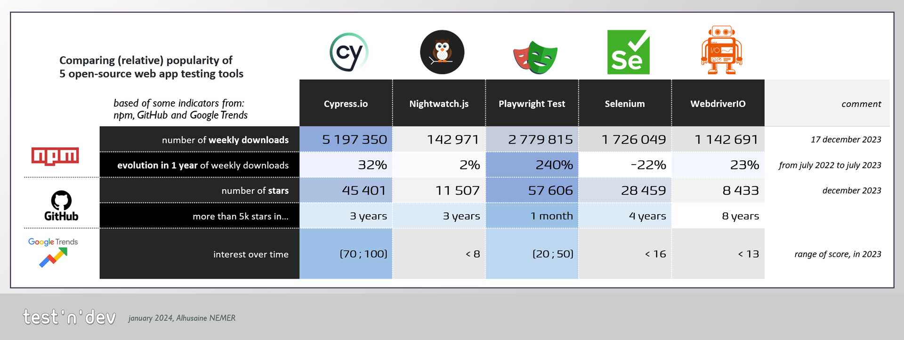

# Benchmark of web-applications testing tools

|           | Benchmark of web-applications testing tools           |
| --------- | ----------------------------------------------------- |
| _Author_  | Alhusaine NEMER – [test'n'dev](https://testndev.com/) |
| _Date_    | 09/02/2024                                            |
| _Version_ | 0.92                                                  |
| _Licence_ | <a href="#licence">CC BY-NC-ND 4.0</a>                |

---

- [Benchmark of web-applications testing tools](#benchmark-of-web-applications-testing-tools)
  - [Introduction](#introduction)
  - [Quick presentation of the compared tools](#quick-presentation-of-the-compared-tools)
  - [Popularity of the 5 tools](#popularity-of-the-5-tools)
  - [Technical comparison](#technical-comparison)
  - [Installation 🚧](#installation-)
  - [Performance 🚧](#performance-)
  - [See also](#see-also)
  - [Conclusion](#conclusion)

---

## Introduction

In this article, I will compare some of **popular tools** used...

- _in_ software development of web applications,
- _for_ testing purposes,
- _in order_ to automaticaly control your web application in a browser and check its behaviour.

I will try to be as objective as possible. It is not a "versus" article, not a "click bait" post, but a comparison of the characteristics, features and performance of each tool.

### selection of tools

We will focus on tools having those characteristics:

- **open-source** tools
- executable on [Node.js](https://nodejs.org) platform
- with possible implementation in TypeScript
- and **mature** and quiet popular

We selected the following 5 tools:

1. [Cypress.io](https://cypress.io/)
2. [Nightwatch.js](https://nightwatchjs.org)
3. [Playwright](https://playwright.dev/)
4. [Selenium WebDriver](https://www.selenium.dev/documentation/webdriver/) (+ a JavaScript testing framework)
5. [WebdriverIO](https://webdriver.io/)

In this article, and to be fair in the comparison, we will take JavaScript/TypeScript versions of Playwright and Selenium.

## Quick presentation of the compared tools

In the table below, the official quick presentations of the 5 tools, as given on their respective websites:

|                             | name                                                                    | presentation                                                                                                                                                                                                                                                                                                                                                                                             |
| --------------------------- | ----------------------------------------------------------------------- | -------------------------------------------------------------------------------------------------------------------------------------------------------------------------------------------------------------------------------------------------------------------------------------------------------------------------------------------------------------------------------------------------------- |
|  | [Cypress.io](https://www.cypress.io/app)                                | **Test modern apps** directly in your **browser**  Build, test, and debug directly in your browser with a seamless developer experience that is loved by developers all around the world. Test your code, not your patience.  With Cypress, you can easily create tests for your modern web applications, debug them visually, and automatically run them in your continuous integration builds. |
|  | [Nightwatch.js](https://nightwatchjs.org)                               | No-compromise **test automation framework** with a powerful set of tools to write, run and debug your tests across web and native mobile applications.                                                                                                                                                                                                                                                   |
|  | [Playwright](https://playwright.dev/)                                   | Playwright enables reliable **end-to-end testing for modern web apps.**                                                                                                                                                                                                                                                                                                                                  |
|  | [Selenium WebDriver](https://www.selenium.dev/documentation/webdriver/) | Selenium **automates browsers**. That's it!   What you do with that power is entirely up to you. Primarily it is for automating web applications for testing purposes, but is certainly not limited to just that.                                                                                                                                                                                    |
|  | [WebdriverIO](https://webdriver.io/)                                    | Next-gen browser and mobile automation **test framework** for Node.js                                                                                                                                                                                                                                                                                                                                    |

### Selenium WebDriver

As you can see, Selenium WebDriver (JavaScript version and the other) is **not a test framework** by itself, contrary to the 4 others. It is (only) a tool to automate browsers. If we want to use it for web-app testing purposes, we will need to integrate it with a testing framework (like Mocha, Jest, etc.).

In many articles/posts/videos, Selenium WebDriver is often compared to Cypress and/or Playwright, as it was, before them, the most popular open-source tool for web-app testing for many years. And it is still popular today. We will compare it to the 4 others in this article.

We will try to take this into account in our comparison, and for code examples, we will use a JavaScript testing framework (here Jest) to compare the 5 tools.

## Popularity of the 5 tools

One of the criteria to choose a tool is its popularity. The more popular a tool is, the more likely it is to be maintained, to have a large community, and to have a lot of resources available (tutorials, plugins, etc.).

To have an overview of "popularity" of each tool, we used indicators retrieved on NPM, GitHub and Google.

Of course, the popularity of a tool is not the only criterion to take into account when choosing a tool. But it is an important one.

In the ["**popularity of the 5 web-app. testing tools**" sub-page](./300-web-app-testing-tools-benchmark-popularity.html), we compare the popularity of the 5 tools, using several indicators.

> _TL;DR:_ as by end of 2023, the popularity of the 5 tools is as follows:
>
> - **Cypress** is today the **most popular tool**, among the 5
> - **Playwright** is gradually **gaining popularity** (see [trends on NPM/GitHub/Google "fame" indicators](./300-web-app-testing-tools-benchmark-popularity.html))
> - **Selenium** remains popular, but has **serious competitors**
> - WebdriverIO is in the 4th position
> - Nightwatch seems to be less popular than the 4 others

The table below gives you an overview of the relative popularity of these 5 tools, with a few indicators and their evolution:

> Disclaimer: the following indicators are not exhaustive, and are only a snapshot of the popularity of the tools at the time of writing this article.

## You said open source?

The 5 tools are officially "open source". But what does it mean? According to the [Open Source Initiative](https://opensource.org/osd/), open source software is software that can be freely used, changed, and shared (in modified or unmodified form) by anyone. Open source software is made by many people, and distributed under licenses that comply with the Open Source Definition.

Those 5 tools are distributed under the following licenses:
- [Apache License, Version 2.0](https://opensource.org/license/apache-2-0/) for Playwright and Selenium
- and [The MIT License](https://opensource.org/licenses/MIT) for Cypress, Nighwatch and WebdriverIO

As other open source projects, those tools are developed by a community of contributors, and are often sponsored by companies.

The fact that a tool is sponsored by a company can be:
- a strong point 👍, as it can ensure the sustainability of the project, and the development of the tool
- or a weak point 👎, if the company decides to change the license, or to stop the development of project

The table below gives you an overview of the licenses and sponsors of the 5 tools:

|         | Cypress         | Nighwatch       | Playwright         | Selenium           | WebdriverIO              |
| ------- | --------------- | --------------- | ------------------ | ------------------ | ------------------------ |
| License | The MIT License | The MIT License | Apache License 2.0 | Apache License 2.0 | The MIT License          |
| Sponsor | Cypress.io      | BrowserStack    | Microsoft          | Community          | BrowserStack + SauceLabs |

### Notes for Cypress

Cypress is developed by [Cypress.io](https://www.cypress.io/about-us), a US-abased company that offers a commercial product based on the open-source project.

### Playwright

Playwright is an open-source project, but it is also a copyrighted product of Microsoft Corporation.
Playwright is developed in the *Developer Division* at Microsoft (which also develops Visual Studio Code, TypeScript, etc.).

## Technical comparison

| aspect                  | Cypress        | Nighwatch      | Playwright             | Selenium + | WebdriverIO        |
| ----------------------- | -------------- | -------------- | ---------------------- | ---------- | ------------------ |
| Other than JS/TS?       | No, only JS/TS | No, only JS/TS | Yes (C#, Java, Python) | Yes, many  | No, only JS/TS     |
| Automation **Protocol** | Inside Browser | WebDriver      | CDP                    | WebDriver  | WebDriver (or CDP) |

### Automation Protocol

We see that the 5 tools use different automation protocols:

- the standard [WebDriver](https://w3c.github.io/webdriver/), which is a W3C standard for browser automation.
- [Chrome DevTools Protocol](https://chromedevtools.github.io/devtools-protocol/) or CDP. It's used by Playwright. It can be also used with WebdriverIO
- for Cypress, it is not a protocol, but a library that runs inside the browser

> ⚠️ to be completed

## Installation 🚧

> ⚠️ to be completed

## Performance 🚧

We will use our code hosted on [`testndev/web-app-testing-tools-benchmark`](https://github.com/testndev/web-app-testing-tools-benchmark/) repository for our technical benchmark.

> ⚠️ to be completed

## See also

There is many articles that compare web-app test automation frameworks (especially Selenium vs Cypress vs Playwright since 2022), presenting their features, trade-offs, etc.

You can read for example:

- ["Which web testing tool should i use?"](https://automationpanda.com/2023/04/24/which-web-testing-tool-should-i-use)
  > (in english, 24/04/2023, by [_Andrew Knight_](https://twitter.com/automationpanda))
- ["Choix du logiciel et avis - Framework : Selenium vs Playwright vs Cypress"](https://blog.mrsuricate.com/choix-logiciel-avis-framework-selenium-playwright-cypress)
  > (in french, 13/03/2023, by [_Mr Suricate_](https://www.mrsuricate.com/))
- ["Playwright vs. the world"](https://medium.com/@jfgreffier/playwright-vs-the-world-c783e9bf4fc4)
  > (in french, 31/01/2023, by [_Jean-François Greffier_](https://linktr.ee/jfgreffier))
- ["Cypress vs Selenium vs Playwright vs Puppeteer speed comparison"](https://rag0g.medium.com/cypress-vs-selenium-vs-playwright-vs-puppeteer-speed-comparison-73fd057c2ae9)
  > (in english, 04/03/2021 by [_Giovanni Rago_](https://rag0g.medium.com/))
- [Comparison with leading frameworks (Nightwatch.js)](https://nightwatchjs.org/guide/comparison-with-leading-frameworks.html)
  > (in english, by [_Nightwatch.js_](https://nightwatchjs.org/))
- State of JS: https://2022.stateofjs.com/en-US/libraries/testing/ ?
- ["Selenium Vs … blog posts"](https://www.selenium.dev/blog/2024/selenium-vs-blog-posts/)
  > in english, 09/01/2024, by [David Burns @AutomatedTester](https://twitter.com/automatedtester)

## Conclusion

> ⚠️ to be completed

---

---

_Licence_

This article is licensed under the terms of the
<a rel="license" href="http://creativecommons.org/licenses/by-nc-nd/4.0/">**Attribution-NonCommercial-NoDerivatives 4.0 International (CC BY-NC-ND 4.0)**</a> License

---

_Credits :_

...

---

_Photo Credits :_

- ...
